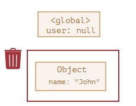

## Достижимость

Основной концепцией управления памятью в JavaScript является принцип _достижимости_.

Если упростить, то «достижимые» значения – это те, которые доступны или используются. Они гарантированно находятся в памяти.

1.  Существует базовое множество достижимых значений, которые не могут быть удалены.
    
    Например:
    
    -   Локальные переменные и параметры текущей функции.
    -   Переменные и параметры других функций в текущей цепочке вложенных вызовов.
    -   Глобальные переменные.
    -   (некоторые другие внутренние значения)
    
    Эти значения мы будем называть _корнями_.
    
2.  Любое другое значение считается достижимым, если оно доступно из корня по ссылке или по цепочке ссылок.
    
    Например, если в локальной переменной есть объект, и он имеет свойство, в котором хранится ссылка на другой объект, то этот объект считается достижимым. И те, на которые он ссылается, тоже достижимы. Далее вы познакомитесь с подробными примерами на эту тему.
    

В интерпретаторе JavaScript есть фоновый процесс, который называется _борщик мусора_ Он следит за всеми объектами и удаляет те, которые стали недостижимы.

Вот самый простой пример:

`// в user находится ссылка на объект`
`let user = {`
  `name: "John"`
`};`

Здесь стрелка обозначает ссылку на объект. Глобальная переменная `user` ссылается на объект `{name: "John"}` (мы будем называть его просто «John»). В свойстве `"name"` объекта John хранится примитив, поэтому оно нарисовано внутри объекта.

Если перезаписать значение `user`, то ссылка потеряется:

`user = null;`

Теперь объект John становится недостижимым. К нему нет доступа, на него нет ссылок. Сборщик мусора удалит эти данные и освободит память.

---
[[Objects]]